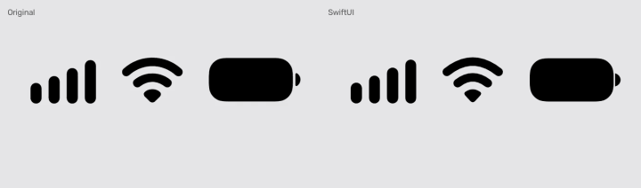
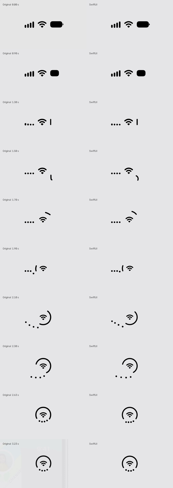

# Circle Status Bar

A frame-by-frame SwiftUI recreation of the circular status bar animation from iPhone Duo:
cellular bars, Wi-Fi and battery melt into a ring around the Wi-Fi glyph.

No videos, no Lottie, no keyframe dumps — just shapes, a handful of easing functions and one pure function of time.



## Highlights

- **Pure function of time.** `StatusBarPose(time:)` returns the position of every element for any timestamp. Scrubbing, speed changes, looping and offline rendering come for free.
- **All numbers in one place.** Layout and timing live in [`Choreography.swift`](Sources/Animation/Choreography.swift), measured in pixels and seconds of the reference video.
- **A shape with variable curvature.** [`BendingStroke`](Sources/Animation/Shapes.swift) turns a straight line into an arc by changing a single `bend` parameter.
- iOS 17+ and macOS 14+, Swift 6, zero dependencies.

## Getting started

```sh
git clone https://github.com/artemnovichkov/CircleStatusBar.git
open CircleStatusBar/CircleStatusBar.xcodeproj
```

Pick the **CircleStatusBar** scheme and run it on *My Mac* or an iOS simulator. The project uses ad-hoc signing, so no team is needed; for a physical device, enable automatic signing and select your team.

The player has play/pause (<kbd>Space</kbd>), a scrubber, 0.25×/0.5×/1× speed and looping — slow motion is the best way to see what's going on.

## How it works

```
Playback ─▶ TimelineView ─▶ time ─▶ StatusBarPose(time:) ─▶ PoseCanvas
 (clock)    (display link)            ▲                      (SwiftUI shapes)
                                      │
                           Choreography + Easing
                           (numbers)      (math)
```

| File | Responsibility |
| --- | --- |
| [`Choreography.swift`](Sources/Animation/Choreography.swift) | Layout constants, timing windows and `StatusBarPose` — what every element looks like at a given time |
| [`Easing.swift`](Sources/Animation/Easing.swift) | `smoothstep`, cubic ease-out, Gaussian pulse, damped oscillation, cubic Bézier |
| [`Shapes.swift`](Sources/Animation/Shapes.swift) | `BendingStroke`, `WiFiGlyph`, `BatteryTerminal` |
| [`CircleStatusBar.swift`](Sources/Animation/CircleStatusBar.swift) | Stateless view that draws a pose and scales the 1280×720 canvas to fit |
| [`Playback.swift`](Sources/Player/Playback.swift) | Wall clock → animation time with play, pause, seek, rate and loop |
| [`PlayerView.swift`](Sources/Player/PlayerView.swift) | Demo UI |

The view has no state and no implicit animations. Use it anywhere:

```swift
CircleStatusBar(time: 2.6)
    .foregroundStyle(.black)
    .frame(width: 640, height: 360)
```

### Timeline

The whole animation takes 3.267 s (98 frames at 30 fps).

| Time, s | What happens | Curve |
| --- | --- | --- |
| 0.70–0.85 | Battery terminal shrinks and fades out | smoothstep |
| 0.84–1.38 | Battery body narrows into a vertical line on the ring's right edge | cubic ease-out |
| 0.90–1.38 | Bars collapse into dots, tallest first | smoothstep, staggered |
| 1.38 | Battery body is swapped for `BendingStroke` of exactly the same size and position | — |
| 1.38–1.53 | Stroke curls, kicks outwards and twists like a hook | Gaussian pulses |
| 1.40–1.90 | Wi-Fi slides to the center and shrinks to 81% | smoothstep |
| 1.50–2.00 | Stroke swings counterclockwise around Wi-Fi | power curve |
| 1.84–2.74 | Dots swoop under the ring and bounce into its gap | Bézier + damped sine |
| 1.90–2.62 | Stroke grows from 76 to 464 px and opens into a ring | cubic ease-out |
| 2.00–2.69 | Stroke decelerates into place at the top | cubic ease-out |

### The tricks

**Hiding the swap.** A `RoundedRectangle` can't bend, a stroked arc can't be a fat rectangle. So the battery first shrinks to a 16×92 pill, and at 1.38 s it is replaced by a 76 px line stroked 16 px wide with round caps — pixel-for-pixel the same pill.

**Bending a line.** `BendingStroke` is parameterized by curvature instead of radius, so zero is a perfectly straight line and there is no infinity to deal with:

```swift
let radius = 1 / bend
let halfAngle = length / radius / 2
path.addArc(center: CGPoint(x: rect.midX - radius, y: rect.midY), radius: radius,
            startAngle: .radians(-halfAngle), endAngle: .radians(halfAngle), clockwise: false)
```

The center of curvature sits to the left of the shape, so when the stroke is placed on the orbit and rotated by the orbit angle, the arc always hugs the ring. Once `bend == 1 / ringRadius`, it *is* the ring.

**Organic accents.** The hook and the outward kick are Gaussian pulses multiplied by a smoothstep, so they appear from nothing and vanish without a trace. The dots' landing is a decaying sine — a spring without a physics engine:

```swift
amplitude * exp(-elapsed * decay) * sin(elapsed * frequency)
```

**A clock you can scrub.** `Playback` doesn't accumulate frame deltas. It stores an anchor — "at this date the animation was at this time" — and re-anchors on every change, so pausing, seeking or switching speed never makes the animation jump.

## Comparison

<details>
<summary>Key frames side by side with the original</summary>



</details>

## Project

The Xcode project is generated from [`project.yml`](project.yml) with [XcodeGen](https://github.com/yonaskolb/XcodeGen); run `xcodegen` after adding files.

## Disclaimer

This is an independent educational project, not affiliated with Apple. iPhone is a trademark of Apple Inc. Frames of the original animation in `Media` are shown for comparison purposes only.

## License

Code is available under the [MIT license](LICENSE).
